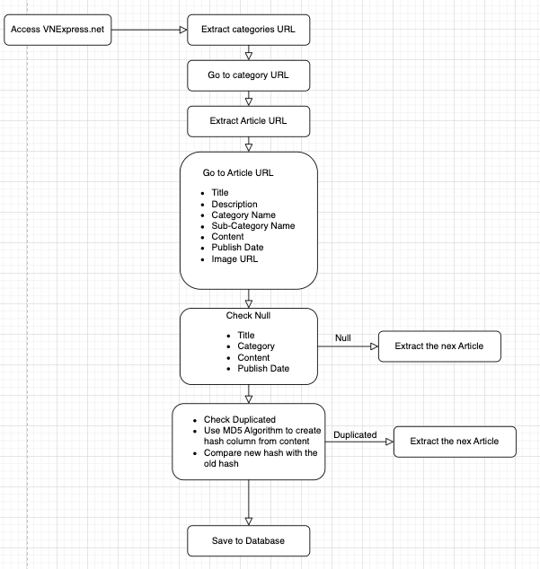
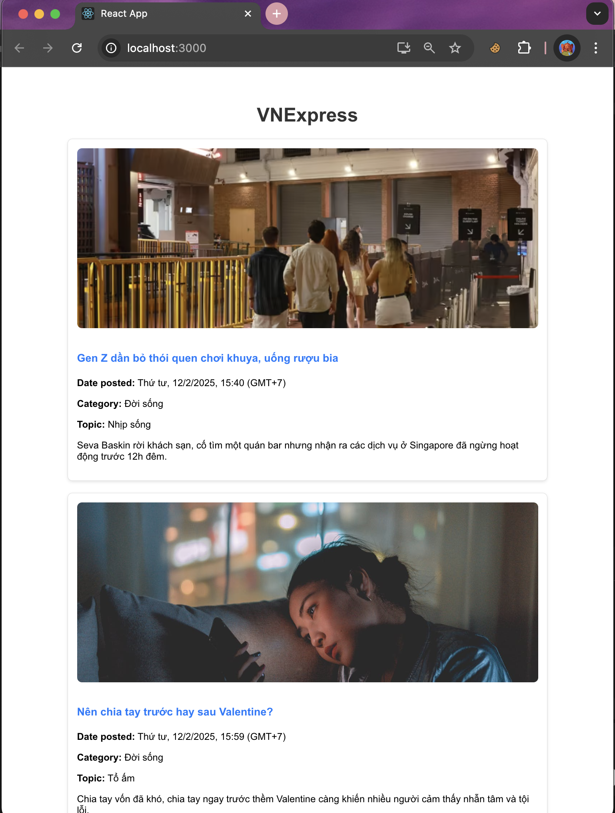
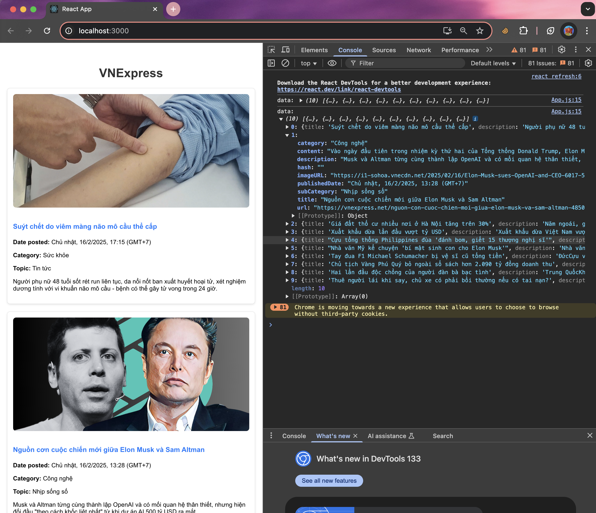

# Project Structure

```
VNExpress_microservices/
├── article-service/          # Golang Backend service for managing articles
│   ├── cmd/                  # Main applications
│   │   └── main.go            
│   ├── models/               # Defines the Article struct, representing an article entity in the database.
│   │   └── articles.go              
│   ├── middleware/           # Middleware for handling CORS (Cross-Origin Resource Sharing) requests.    
│   │   └── cors.go/
│   ├── repo/                  
│   │   ├── article_repo.go   # Contains database queries for managing article data.
│   │   └── connect.go        # Handles database connection setup.
│   ├── handlers/             # Defines HTTP handlers (API endpoints) for managing articles.   
│   │   └── article_handler.go           
│   ├── services/             # Implements the business logic for handling articles.  
│   │   └── article_service.go             
│   ├── configs/              # Configuration files
│   │   └── env.go            # Loads environment variables from .env for configuration settings.
│   ├── go.mod                # Defines Go module dependencies.
│   ├── go.sum                # Tracks exact versions of dependencies.
│   ├── .env                
│   └── article-service.Dockerfile # Dockerfile to containerize the article-service.              
│
├── crawl-service/            # Scrapes and stores VNExpress articles using Colly framework
│   ├── cmd/               
│   │   └── main.go  
│   ├── configs/              # Configuration files
│   │   └── env.go            # Loads environment variables from .env for configuration settings.
│   ├── crawler/                  
│   │   ├── article_detail.go # Extracts full article details.
│   │   ├── article_url.go    # Fetches article URLs from category pages
│   │   ├── categories.go     # Fetches categories URLs from home page
│   │   └── collector.go 
│   ├── example_data/          
│   │   └── vnexpress_data.xlsx  
│   ├── models/             
│   │   └── articles.go
│   ├── storage/                  
│   │   ├── postgres/
│   │   │   ├── connect.go    # connection to PostgreSQL.
│   │   │   └── operation.go  # Implements database operations for storing articles.
│   │   └── excel.go 
│   ├── go.mod                # Defines Go module dependencies.
│   ├── go.sum                # Tracks exact versions of dependencies.
│   ├── .env                
│   └── crawl-service.Dockerfile # Dockerfile to containerize the article-service. 
│
├── vnexpress-wed/            # React frontend for displaying articles
│   ├── public/               # Static assets
│   ├── src/                  # Application source code
│   │   └── App.js
│   │   └── ...
│   ├── package.json          # Lists dependencies and scripts for the frontend.
├── .gitignore                # Git ignore rules
├── .env                      # Stores environment variables
├── docker-compose.yml        # Orchestrates microservices in Docker
└── README.md                 # Project overview
```

## Overview
In this project, I am building a newspaper page with functions such as: search-engine, login/logout, extracting data from **Vnexpress website** and displaying them on a simple interface using **React.js**. My main goal in this project is to build a system that is easy to expand and maintain in the future and will build more features to the system
- Use **Microservices Architecture** to separate the application into many independent services and each service only performs a specific feature
- Services will communicate with each other via **RESTful API**
- The system will have services such as: 
    - **Extract-service** : Uses **Colly Framework** in go to retrieve data on [vnexpress.net](https://vnexpress.net/)
    - **Article-service** : Uses **Golang** to build back-end whose main function is to retrieve data from **Postgres** and display data
    - **Authentication-service** : Checks if the user is registered and if the user is an admin
    - **Broker-service** : Acts as a receptionist to coordinate user requests for **microservices**
    - **Client-service** : uses **React.js** to build user interface
    - **Search-service** : Use **ElasticSearch** or **FullText-Search** for this service
    - **... More services will be added in the future ...**

## 🚀 Technologies Used  
- **Programming Language:** Golang  
- **Database:** PostgreSQL  
- **Authentication:** JWT  
- **Containerization:** Docker  
- **Orchestration:** Kubernetes (K8s)  
- **CI/CD:** GitHub Actions

## Flow Crawl Data



## How to Run
**Step 1**: Set up file .env 
``` sh
#POSTGRES DATABASE CONFIG
POSTGRES_HOST=postgres
POSTGRES_USER=your_username
POSTGRES_PASSWORD=your_password
POSTGRES_DB=your_db
POSTGRES_PORT=your_port

#POSTGRES ADMIN CONFIG
PGADMIN_DEFAULT_EMAIL=your_email
PGADMIN_DEFAULT_PASSWORD=your_password
PGADMIN_PORT=your_port

#POSTGRES ADMIN CONFIG
CRAWL_SERVICE_PORT=your_port

#ARTICLE SERVICE CONFIG
ARTICLE_SERVICE_PORT=your_port
```

**Step 2**: Set up file .env in crawl-service
``` sh
BASE_URL=https://vnexpress.net
EXCEL_FILE=vnexpress_data.xlsx
ALLOWED_DOMAINS=vnexpress.net

#POSTGRES DATABASE CONFIG
POSTGRES_HOST=postgres
POSTGRES_USER=your_username
POSTGRES_PASSWORD=your_password
POSTGRES_DB=your_db
POSTGRES_PORT=your_port
```

**Step 3**: Set up file .env in article-service
``` sh
#POSTGRES DATABASE CONFIG
POSTGRES_HOST=postgres
POSTGRES_USER=your_username
POSTGRES_PASSWORD=your_password
POSTGRES_DB=your_db
POSTGRES_PORT=your_port
```

Ensure you have Docker installed, then run:
```sh
docker-compose up --build -d
```
## MY INTERFACE


