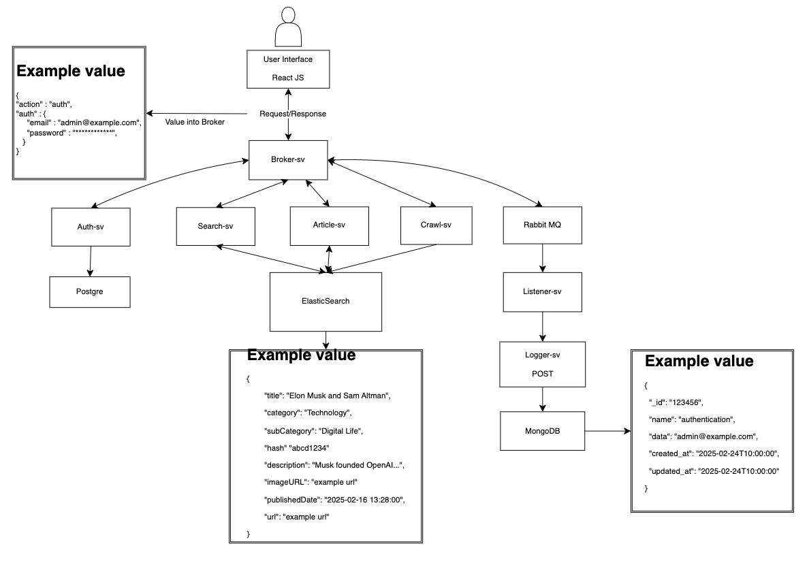

## Overview
In this project, I am building a newspaper page with functions such as: search-engine, login/logout, extracting data from **Vnexpress website** and displaying them on a simple interface using **React.js**. My main goal in this project is to build a system that is easy to expand and maintain in the future and will build more features to the system
- Use **Microservices Architecture** to separate the application into many independent services and each service only performs a specific feature
- Services will communicate with each other via **RESTful API**
- The system will have services such as: 
    - **Extract-service** : Uses **Colly Framework** in Golang to retrieve data on [vnexpress.net](https://vnexpress.net/) and save to **ElasticSearch**
    - **Article-service** : Uses **Golang** to build back-end whose main function is to retrieve data from **Postgres** and display data
    - **Authentication-service** : Checks if the user is registered and if the user is an admin
    - **Broker-service** : Acts as a receptionist to coordinate user requests for **microservices**
    - **Client-service** : uses **React.js** to build user interface
    - **Listener-service** : As a consumer takes messages from the queue and gives them to **Logger-services**
    - **Logger-service** : Input of Logger services is received from Listener Service. Store in MongoDB information about errors, or important system operations.
    - **Search-service** : Use **ElasticSearch** or **FullText-Search** for this service
    - **... More services will be added in the future ...**

## Architecture 


## 🚀 Technologies Used  
- **Programming Language:** Golang  
- **Database:** PostgreSQL and MongoDB
- **Search-engine** : ElasticSearch
- **Authentication:** JWT  
- **Que Message** Rabbit MQ
- **Containerization:** Docker  
- **Orchestration:** Kubernetes(K8s)  
- **CI/CD:** Jenkines

## Flow Crawl Data


## How to Run
**Step 1**: Set up file .env 
``` sh
#POSTGRES DATABASE CONFIG
POSTGRES_HOST=postgres
POSTGRES_USER=your_username
POSTGRES_PASSWORD=your_password
POSTGRES_DB=your_db
POSTGRES_PORT=your_port

#POSTGRES ADMIN CONFIG
PGADMIN_DEFAULT_EMAIL=your_email
PGADMIN_DEFAULT_PASSWORD=your_password
PGADMIN_PORT=your_port

#POSTGRES ADMIN CONFIG
CRAWL_SERVICE_PORT=your_port

#ARTICLE SERVICE CONFIG
ARTICLE_SERVICE_PORT=your_port
```

Ensure you have Docker installed, then run:
```sh
docker-compose up --build -d
```